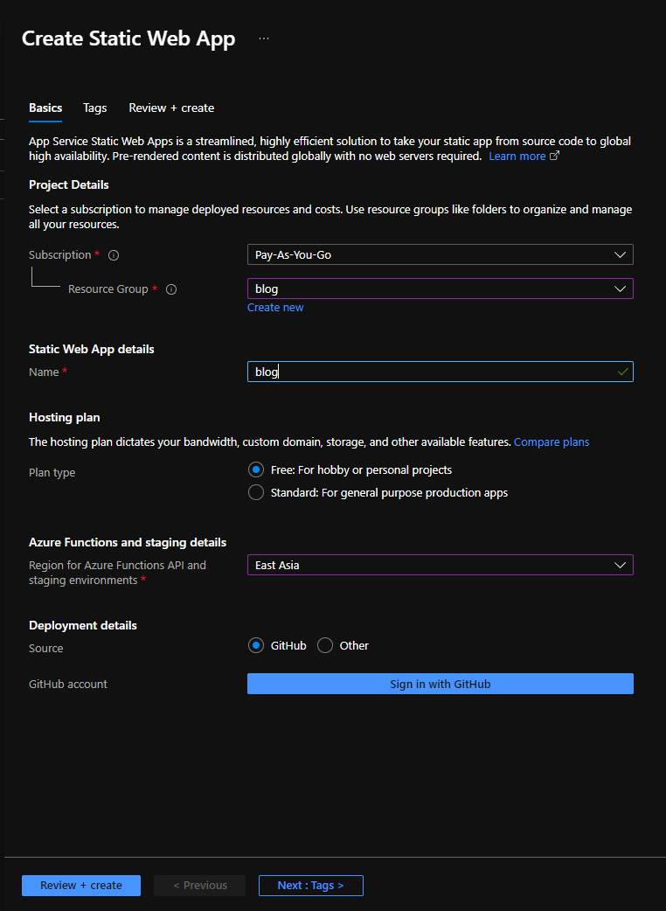
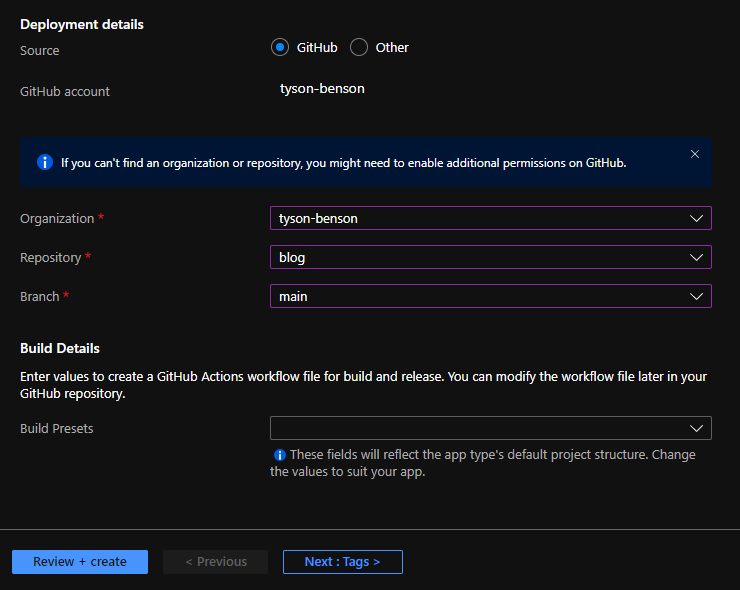
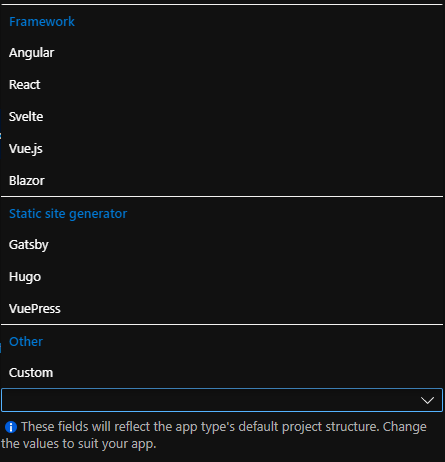
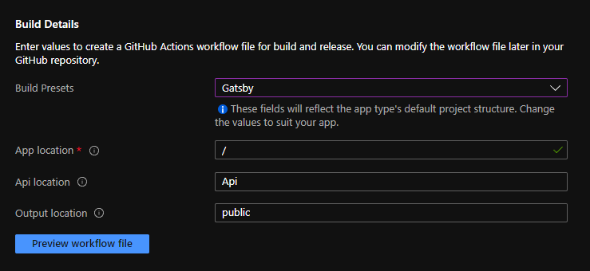
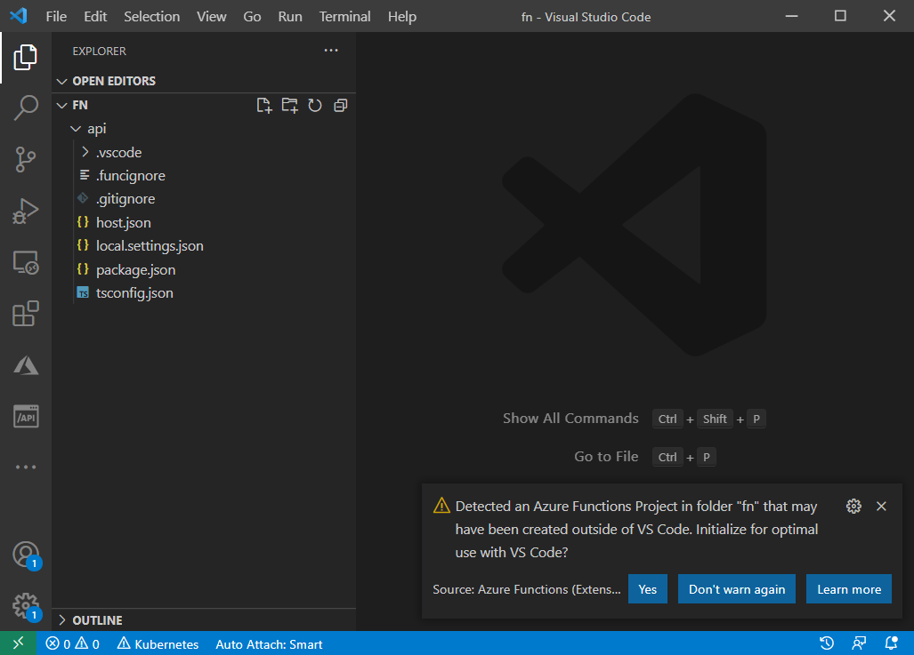

The team at Azure appear to have worked hard on streamlining the experience of getting up and started with SPA style web apps with [Static Web Apps](https://azure.microsoft.com/en-au/services/app-service/static/) (SWA). It's the convergence of a handful of cloud native technologies that go hand in hand to building modern applications, including:

- **CDN** - for hosting the static generated content, html, css, & JS.
- **Serverless compute** - with function apps for building out a backend, if you need it.
- **CI/CD out of the box** - when you create the SWA via Azure Portal, neatly integrating with GitHub.
- **Blue/Green** - automated staging deployments to test your changes in Azure before pushing it to production.
- **CLI/IDE tooling/local emulation** - for productive local development, including emulation of identity and role based access control.
- **Secure by default** - each SWA gets a free, automatically renewed, SSL certificate.

Happily, Azure SWAs are framework agnostic, but not framework ignorant. What I mean by this is that there are straightforward flows and smart defaults for starting a SWA with your framework of choice. For anyone that needs a helping hand Microsoft has published [learning modules for SWAs](https://docs.microsoft.com/en-au/learn/paths/azure-static-web-apps/).

> Now that [Static Web Apps have gone GA](https://azure.microsoft.com/en-au/blog/develop-production-scale-modern-web-apps-quickly-with-azure-static-web-apps/) we know the free plan is here to stay. Naturally, it has some limits but it's hard to beat that for value.

## This blog is an SWA

Most of my experience with developing static web apps has been with [Angular](https://angular.io/). But for this blog I decided to try learning something different and put my out of my comfort zone just a little. So when I reviewed the list of frameworks that are in vogue today, I felt like Gatsby (built on React) would be relatively easy to get started with, and give me some features out of the box so I don't spend time reinventing the wheel when it comes to implementing blogging functionality.

## Getting started

I decided to use the Gatsby [starter blog template](https://www.gatsbyjs.com/starters/gatsbyjs/gatsby-starter-blog).

This is the process I followed to get my blog going.

1. Create a repo in GitHub (I created a public repo for my blog, because why not?)
2. Clone this blog repo (I like using [GitHub Desktop](https://desktop.github.com/) for managing local repos, committing, branching and merging)
3. Start a terminal from the working directory at the root of the cloned repo.
4. Generate the gatsby app by running the starter template command:
   ```powershell{prompt:PS C:\GitHub\blog>}{1}
   npx gatsby new gatsby https://github.com/gatsbyjs/gatsby-starter-blog
   ```
5. If you plan on having an API, create an azure function app under the `api` directory using the Azure Functions CLI, selecting your preferred language:
   ```powershell{prompt:PS C:\GitHub\blog>}{outputLines:2-8}{1}
   func init api
   Use the up/down arrow keys to select a worker runtime:
   dotnet
   dotnet (isolated process)
   node
   python
   powershell
   custom
   ```
   If you do create an API, VS code will detect the function app when it starts and helpfully suggest you to initialise your workspace for an optimal experience. THis will create the `.vscode` folder and add some files (launch.json, tasks.json) for you to make debugging easier.
6. Commit the initial code and push it up to GitHub.
7. Login to Azure Portal and create a Static Web App. At a minimum you will need to specify the app's:
   - resource group
   - name
   - plan type (free/standard - if you choose free there will be some limitations<sup>[1](#footnote-limitations)</sup>, but you can always upgrade it later)
   - region (there are limited choices here for now, I'd like to see more added in the future)
     
8. Before you finish creating the SWA, use the 'Sign in with GitHub' button to authorise Azure Portal to setup a GitHub Action in your blog repo. The GitHub Action is smart enough to know how to compile the gatsby app, as well as the function app and deploy them into Azure.
   - after you authorise Azure Portal to access your GitHub repositories, you'll be prompted to select your organisation (optional), repo and branch.
     
   - finally, you can specify the framework you're using to configure the GitHub Action to be aware of the source code location in your repo
     
   - this will populate the GitHub Action with the parameters that correspond to the conventions of each framework so that it knows where the source code, api, and build output directories are located, this is mostly for your convenience
     

This will give you a workflow that looks something like this:

```yaml
name: Azure Static Web Apps CI/CD

on:
  push:
    branches:
      - main
  pull_request:
    types: [opened, synchronize, reopened, closed]
    branches:
      - main

  workflow_dispatch:

jobs:
  build_and_deploy_job:
    if: github.event_name == 'push' || (github.event_name == 'pull_request' && github.event.action != 'closed') || github.event_name == 'workflow_dispatch'
    runs-on: ubuntu-latest
    name: Build and Deploy Job
    steps:
      - uses: actions/checkout@v2
        with:
          submodules: true
      - name: Build And Deploy
        id: builddeploy
        uses: Azure/static-web-apps-deploy@v1
        with:
          azure_static_web_apps_api_token: ${{ secrets.AZURE_STATIC_WEB_APPS_API_TOKEN_JOLLY_SAND_05B56C11E }}
          repo_token: ${{ secrets.GITHUB_TOKEN }} # Used for Github integrations (i.e. PR comments)
          action: "upload"
          ###### Repository/Build Configurations - These values can be configured to match your app requirements. ######
          # For more information regarding Static Web App workflow configurations, please visit: https://aka.ms/swaworkflowconfig
          app_location: "/" # App source code path
          api_location: "api" # Api source code path - optional
          output_location: "public" # Built app content directory - optional
          ###### End of Repository/Build Configurations ######

  close_pull_request_job:
    if: github.event_name == 'pull_request' && github.event.action == 'closed'
    runs-on: ubuntu-latest
    name: Close Pull Request Job
    steps:
      - name: Close Pull Request
        id: closepullrequest
        uses: Azure/static-web-apps-deploy@v1
        with:
          azure_static_web_apps_api_token: ${{ secrets.AZURE_STATIC_WEB_APPS_API_TOKEN_JOLLY_SAND_05B56C11E }}
          action: "close"
```

> GitHub Workflows are written in [YAML](https://en.wikipedia.org/wiki/YAML) which is a very readable, human-friendly configuration language. If you want to learn how to write YAML, I thought [TechWorld with Nana's tutorial video](https://www.youtube.com/watch?v=1uFVr15xDGg) explains it very well.

I wanted to organise my code a little differently, so I ended up moving the gatsby application into its own directory called `gatsby` to sit side-by-side with the `api` folder, and this meant that I needed to update the workflow's `app_location` parameter (see below). You can review my [blog repo's folder structure](https://github.com/tyson-benson/blog) and [GitHub Action](https://github.com/tyson-benson/blog/blob/main/.github/workflows/azure-static-web-apps-jolly-sand-05b56c11e.yml) setup to see the folder structure and how it all hangs together.

```diff-yaml
- app_location: "/" # App source code path
+ app_location: "gatsby" # App source code path
```

### Github Secrets

Another thing the Azure Portal did when it saved the github action yml file to your repository is that it created a repo secret, so that GitHub could actually deploy the application into Azure. The workflow requests the secret from GitHub by referencing the secret's name. Note that the name of the secret isn't sensitive, just its value - which is [stored securely by GitHub](https://docs.github.com/en/actions/security-guides/encrypted-secrets). In the workflow above you can see the secret is named: `AZURE_STATIC_WEB_APPS_API_TOKEN_HAPPY_CLOUD_0123456798`

### Digging into the workflow

The workflow will be triggered by three main events:

#1 - when changes are either pushed directly into main (assuming you're developing straight on the main branch), or when changes are pushed to the main branch after merging a pull request.

```yaml
on:
  push:
    branches:
      - main
```

#2 - when creating, closing or reopening a pull request & pushing changes to the pull request (synchronize)

```yaml
on:
  ...
  pull_request:
    types: [opened, synchronize, reopened, closed]
    branches:
      - main
```

#3 - when the GitHub Action is triggered manually

```yaml
on:
  ...
  workflow_dispatch:

```

There are two tasks in the workflow that are run conditionally. Each task has a different purpose, the first and most important task will compile the code and deploy it to Azure. The condition will check if code was pushed into either the main branch, some work is happening in a pull request, or the workflow was triggered manually.

```yaml
jobs:
  build_and_deploy_job:
    if: github.event_name == 'push' || (github.event_name == 'pull_request' && github.event.action != 'closed') || github.event_name == 'workflow_dispatch'
```

The build steps are pretty simple, clone the git repo, and run docker image from the [Azure/static-web-apps-deploy](https://github.com/Azure/static-web-apps-deploy) repo, where all the generic framework agnostic build tooling<sup>[2](#footnote-oryx)</sup> is contained. Note that this docker program will only run on the Ubuntu agent, so keep that in mind if you're planning on extending the workflow.

```yaml
name: Build and Deploy Job
steps:
  - uses: actions/checkout@v2
    with:
      submodules: true
  - name: Build And Deploy
    id: builddeploy
    uses: Azure/static-web-apps-deploy@v1
      with:
        azure_static_web_apps_api_token: ${{ secrets.AZURE_STATIC_WEB_APPS_API_TOKEN_JOLLY_SAND_05B56C11E }}
        repo_token: ${{ secrets.GITHUB_TOKEN }} # Used for Github integrations (i.e. PR comments)
        action: "upload"
        app_location: "gatsby" # App source code path
        api_location: "api" # Api source code path - optional
        output_location: "public" # Built app content directory - optional
```

If you're working in a team and you use pull requests, the other workflow job will come into play when you close a pull request. I haven't been able to review the code, so I'm guessing that this task's main purpose is to delete the staging deployments created for the pull request.

```yaml
close_pull_request_job:
  if: github.event_name == 'pull_request' && github.event.action == 'closed'
  runs-on: ubuntu-latest
  name: Close Pull Request Job
  steps:
    - name: Close Pull Request
      id: closepullrequest
      uses: Azure/static-web-apps-deploy@v1
      with:
        azure_static_web_apps_api_token: ${{ secrets.AZURE_STATIC_WEB_APPS_API_TOKEN_HAPPY_CLOUD_0123456798 }}
        action: "close"
```

There might be some issues with this process, because after a few deployments, the build and deploy task started failing because I had reached my staging slot limit. I after manually deleting the staging slots did the build start succeeding again. When I ran into this situation, the error message was quite helpful:

```log
ERROR: The content server has rejected the request with: BadRequest
Reason: This Static Web App already has the maximum number of staging environments (10). Please remove one and try again.
```

Of course, there's a lot more detail in the Microsoft Docs for [SWA build configuration](https://docs.microsoft.com/en-au/azure/static-web-apps/build-configuration?tabs=github-actions). Including some info that will be helpful for adapting the workflow when the app is part of a [monorepo](https://docs.microsoft.com/en-au/azure/static-web-apps/build-configuration?tabs=github-actions#monorepo-support).

## Using the SWA CLI

Normally when you're developing a SPA you will use the respective CLI for the framework you're using to build and run the app. Like `ng serve` for Angular, or `gastby develop` for Gatsby. And you can still do that if all you're building is a purely static app. But if you're building an app that has authentication, and backend API's, you'll want to use the Azure SWA CLI. Which you can install from NPM like so:

```powershell
npm i -g @azure/static-web-apps-cli
```

When you launch your app with the SWA CLI, it will setup a proxy for the SPA and the API, and it will emulate the identity provider. The command for starting the SPA alone is:

```powershell{prompt:PS C:\GitHub\blog\gatsby>}
swa start https://localhost:8000/ --run "npm start" --api ..\api\
```

You can see a list of example commands for the SWA CLI with:

```powershell
swa help start
```

## Simpler debugging, hit F5!

When I first started building a SWA, I was manually running these commands (`swa start` and `func host start`) from VS Code's terminal to build and start the app for local dev/testing. Later I learned, from an [Azure Friday video featuring Anthony Chu](https://www.youtube.com/watch?v=AMhhuBixb4o), there was a way to configure VS Code to start both the SPA and the API and attach the debugger to both of them simultaneously.

Anthony didn't cover how he did this in the video (probably because it would disrupt the flow of the demo), but I did track down the [repo he used in the demonstration](https://github.com/anthonychu/swa-weather-react). So after reviewing the [launch.json](https://github.com/anthonychu/swa-weather-react/blob/main/.vscode/launch.json) and [tasks.json](https://github.com/anthonychu/swa-weather-react/blob/main/.vscode/tasks.json), I applied the same changes to my repo, with some small modifications (port numbers), to account for the differences between plain React apps and Gatsby.

With these changes I'm now able to hit F5 and set breakpoints anywhere (frontend or backend) and never leave VS Code in my dev/test inner loop.

**launch.json**

```diff-json
{
  "version": "0.2.0",
  "configurations": [
    {
      "name": "Attach to Node Functions",
      "type": "node",
      "request": "attach",
      "port": 9229,
-      "preLaunchTask": "func: host start"
+      "preLaunchTask": "func: host start",
+      "presentation": {
+        "hidden": true,
+        "group": "",
+        "order": 1
+      }
+    },
+    {
+      "name": "Launch Browser",
+      "request": "launch",
+      "type": "pwa-chrome",
+      "url": "http://localhost:4280",
+      "webRoot": "${workspaceFolder}",
+      "preLaunchTask": "swa start",
+      "presentation": {
+        "hidden": true,
+        "group": "",
+        "order": 1
+      }
+    }
+  ],
+  "compounds": [
+    {
+      "name": "Launch Static Web App",
+      "configurations": ["Attach to Node Functions", "Launch Browser"],
+      "stopAll": true,
+      "preLaunchTask": "swa start"
    }
  ]
}
```

**tasks.json**

```diff-json
{
  "version": "2.0.0",
  "tasks": [
    {
      "type": "func",
      "command": "host start",
      "problemMatcher": "$func-node-watch",
      "isBackground": true,
      "dependsOn": "npm build (functions)",
      "options": {
        "cwd": "${workspaceFolder}/api",
        "env": {
          "languageWorkers__node__arguments": "--inspect=9229"
        }
      }
    },
    {
      "type": "shell",
      "label": "npm build (functions)",
      "command": "npm run build",
      "dependsOn": "npm install (functions)",
      "problemMatcher": "$tsc",
      "options": {
        "cwd": "${workspaceFolder}/api"
      }
    },
    {
      "type": "shell",
      "label": "npm install (functions)",
      "command": "npm install",
      "options": {
        "cwd": "${workspaceFolder}/api"
      }
    },
    {
      "type": "shell",
      "label": "npm prune (functions)",
      "command": "npm prune --production",
      "dependsOn": "npm build (functions)",
      "problemMatcher": [],
      "options": {
        "cwd": "${workspaceFolder}/api"
      }
+    },
+    {
+      "type": "shell",
+      "label": "gatsby develop",
+      "command": "gatsby develop",
+      "dependsOn": [],
+      "isBackground": true,
+      "problemMatcher": [
+        {
+          "pattern": [
+            {
+              "regexp": ".",
+              "file": 1,
+              "location": 2,
+              "message": 3
+            }
+          ],
+          "background": {
+            "activeOnStart": true,
+            "beginsPattern": ".",
+            "endsPattern": "success Building development bundle"
+          }
+        }
+      ],
+      "options": {
+        "cwd": "${workspaceFolder}/gatsby"
+      }
+    },
+    {
+      "type": "shell",
+      "label": "swa start",
+      "command": "swa start http://localhost:8000/ --api http://localhost:7071",
+      "isBackground": true,
+      "problemMatcher": [
+        {
+          "pattern": [
+            {
+              "regexp": ".",
+              "file": 1,
+              "location": 2,
+              "message": 3
+            }
+          ],
+          "background": {
+            "activeOnStart": true,
+            "beginsPattern": ".",
+            "endsPattern": "Waiting for .+7071 to be ready"
+          }
+        }
+      ],
+      "options": {
+        "cwd": "${workspaceFolder}/gatsby"
+      },
+      "dependsOn": "gatsby develop"
    }
  ]
}
```

This essentially adds a _composite_ Run & Debug configuration that runs the gatsby develop, func host start & swa start commands, launches a browser and attaches debuggers to the JS app and the API.

I also followed Anthony Chu's example to hide the individual launch configurations from the VS code UI, for simplicity's sake.

## Dev Dependencies

If you're new to some of these technologies, for your convenience I've compiled this reasonably complete list of things that I used in the process.

- A [GitHub](https://github.com/) Account
- An [Azure](https://azure.microsoft.com/) Account
- [Git](https://git-scm.com/downloads)
- [GitHub Desktop](https://desktop.github.com/) (nice to have)
- [.NET SDK](https://dotnet.microsoft.com/download/dotnet) (v3.1, + v5 if you want the new isolate functions)
- [NodeJS](https://nodejs.org/en/) ([v14](https://nodejs.org/download/release/v14.18.1/), if you're building APIs in NodeJS)
- NPM packages (installed globally)
  ```powershell
  npm i -g @azure/static-web-apps-cli
  npm i -g azure-functions-core-tools@3 --unsafe-perm true
  npm i -g azurite # Azure Storage emulator, pairs with Azure Functions emulator
  ```
- [VS Code](https://code.visualstudio.com/)
- The CLI for your JS framework of choice:
  ```powershell
  npm i -g @angular/cli
  npm i -g @vue/cli
  npm i -g gatsby-cli
  npm i -g next
  # etc
  ```

## Suggestions to the Azure team

There are so many productivity improvements across the board with Static Web Apps for developers. If I could wave a magic want to make one thing better, it would be to further improve the developer experience by having the VS Code launch.json and tasks.json files updated automatically (probably by the SWA VS Code extension). Similar to how the [Azure Functions VS Code extension](https://marketplace.visualstudio.com/items?itemName=ms-azuretools.vscode-azurefunctions) [helps to initialise the workspace](https://github.com/Microsoft/vscode-azurefunctions/wiki/Project-Structure), or manually with a `Ctrl+Shift+P` command.



## Closing thoughts

I think Static Web Apps will be used by developers to cut through the less interesting parts of kickstarting a web app project, whether it's a hobby project, a proof-of-concept at work, or the beginnings of a full blown professional application.

It becomes so easy to setup an app with all the essential ingredients, fast & cheap hosting, always on security, observability with Azure Monitor & App Insights, an identity provider and role-based access control, source control, build & deploy pipelines, automated CD/CD. Throw in Azure CosmosDB (which also has a free tier) and you've got basically everything you need to build a solid app.

Exciting stuff.

---

### Footnotes

<small>
<a id="footnote-limitations">1</a>: You wont be able to bring your own separate functions app, and the function app you deploy will be limited to HTTP triggers, so no Timer triggers.

<a id="footnote-oryx">2</a>: Oryx is the underlying tool that intelligently analyses your code and decides how to build it and capture the artefacts. It supports dotnet, golang, java, nodejs, php, python and ruby programs. It also supports building multi-platform projects, e.g. dotnet + nodejs + python.
</small>
