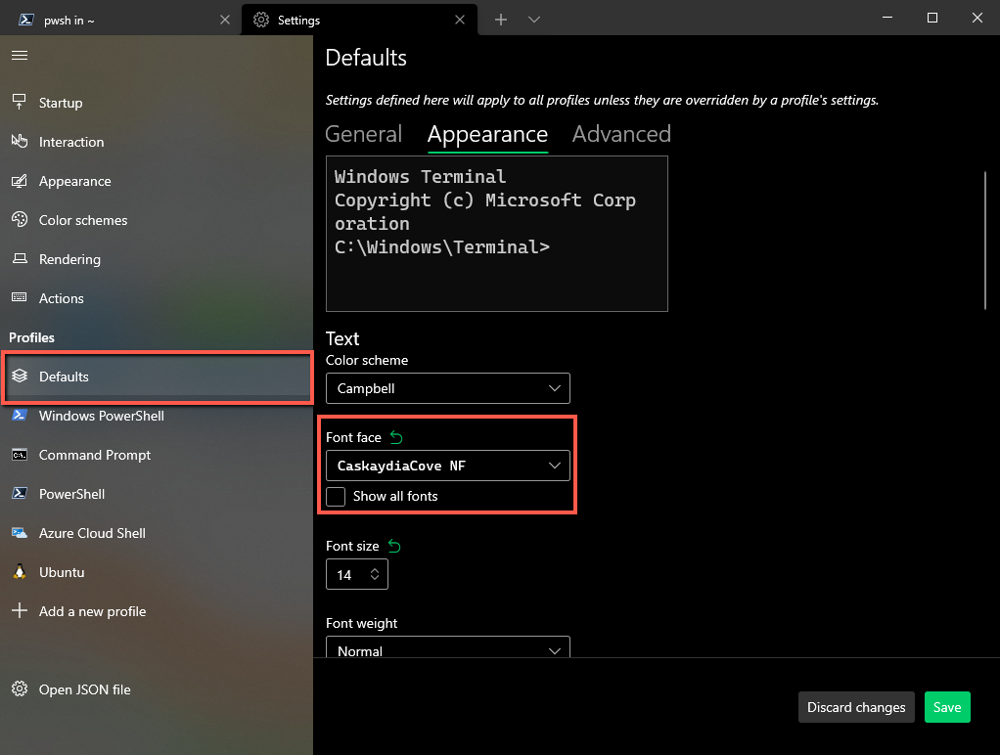
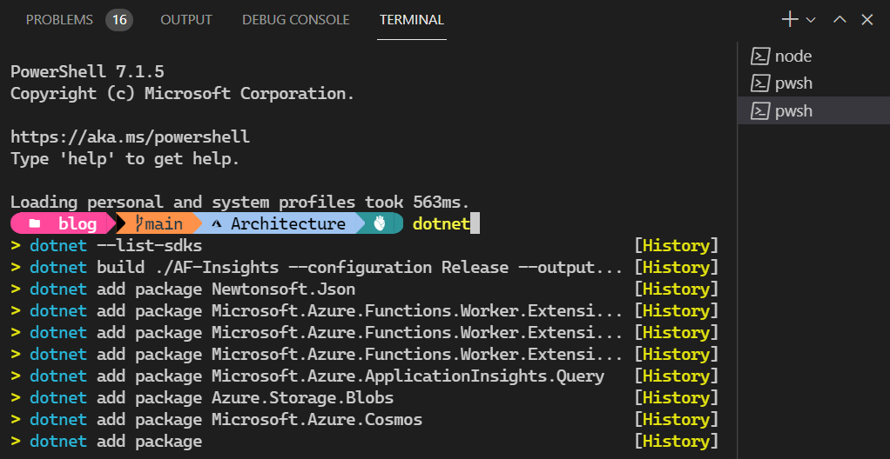
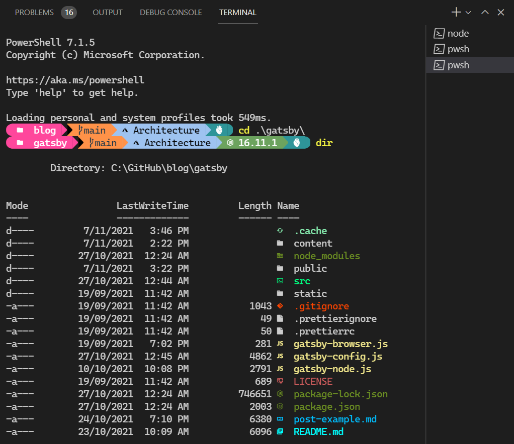

I was watching another video from Scott Hanselman where he was demonstrating the [dotnet hot reload](https://youtu.be/4S3vPzawnoQ) feature coming in .NET 6, which on its own is very cool and worth digging into, but I noticed his shell had a few goodies which triggered my nerd envy.

Scott wrote about how he sets up his Windows Terminal and VS Code in a [blog post](https://www.hanselman.com/blog/my-ultimate-powershell-prompt-with-oh-my-posh-and-the-windows-terminal) with an accompanying [video](https://www.youtube.com/watch?v=VT2L1SXFq9U), so I followed along and set mine up in the same way. This blog is my condensed version that I want to write for myself as much as anyone else so I can come back and set it up again if I ever need to.

## Windows Terminal

Install [Powershell 7.x.x](https://docs.microsoft.com/en-us/powershell/scripting/overview)

Install Windows Terminal, from [GitHub](https://github.com/microsoft/terminal/releases) or [Windows Store](https://www.microsoft.com/en-us/p/windows-terminal/9n0dx20hk701?activetab=pivot:overviewtab)

Install Oh My Posh, [latest instructions for Powershell](https://ohmyposh.dev/docs/pwsh), (you could also use winget)

```powershell
Install-Module oh-my-posh -Scope CurrentUser
```

Download and install a font with glyphs, e.g. 'Caskaydia Cove Nerd Font' from [Nerd Fonts](https://www.nerdfonts.com/font-downloads)

Open Windows Terminal to configure the default font:

1. Open the settings with `Ctrl+,`
2. Select the 'Defaults' profile
3. Select the 'Appearance' tab
4. Change the Font face to `CaskaydiaCove NF`



Select a theme you like, either see how it looks straight from PowerShell with `Get-PoshThemes`, or [take a look on the website](https://ohmyposh.dev/docs/themes).

Customise your theme, you can set one of the existing themes with `Set-PoshPrompt -Theme jandedobbeleer`, or edit the theme file yourself. I found the theme file with `Get-PoshContext`, with gave me the path to the theme file, which I then opened in VS Code and referred to the [documentation on segments](https://ohmyposh.dev/docs/) to begin customising the prompt.

Add/remove segments from the theme that make sense for you and the tech you use.

- I added: Azure, Dotnet
- I removed: Session, Execution Time, Battery, AWS, Ruby

### Extra-super-powers

For intellisense-style autocomplete you can install `PSReadLine`:

```powershell
Install-Module PSReadLine -AllowPrerelease -Force
```



For a nicer looking directory traversal experience install `Terminal-Icons`:

```powershell
Install-Module -Name Terminal-Icons -Repository PSGallery
```



And finally, to speed up getting from a to b when you use `cd` a lot to get around, the `z` module learns your most frequently learned CD commands and makes them searchable.

```powershell
Install-Module z -AllowClobber
```

To get started using these new modules, you'll need to import and configure them in your powershell profile, which is itself a powershell file that runs when you launch it. To edit it, run `code $PROFILE`.

```powershell
Set-PoshPrompt -Theme jandedobbeleer
Import-Module -Name Terminal-Icons
Import-Module PSReadLine
Set-PSReadLineOption -PredictionSource History
Set-PSReadLineOption -PredictionViewStyle ListView
Set-PSReadLineOption -EditMode Windows
```

There's a lot more you can do in the powershell profile, but I'm a man of simple tastes, for now...

## VS Code

If you use VS Code, you'll want to ensure that the font family is updated so that the integrated shell can render all the same information that Windows Terminal now includes in the prompt. Otherwise it'll look broken, because VS Code's default font does not contain the glyphs/icons used by Oh My Posh.

Open the VS Code settings JSON with `Ctrl+Shift+P`, configure the editor fontFamily setting as below.

```json
{
  ...
  "editor.fontFamily": "'CaskaydiaCove NF', Consolas, 'Courier New', monospace"
}
```

You could just specify the new font by itself, but I chose to add the new font on top of the default font stack.

> **IMPORTANT** If the editor and terminal font looks weird, Restart VS Code.

## Going further

There was plenty more ground that Scott covered in his video, like adding keyboard combo shortcuts like `Ctrl+Shift+B` to run `dotnet build`, handy for those who have built up muscle memory for IDE shortcuts. Check out his [video](https://www.youtube.com/watch?v=VT2L1SXFq9U), its a long-ish video, but its easy to follow along and gives you a good idea of the problem solving process when you run in to difficulty.

## Wrapping up

For anyone discovering this blogpost in 2025, let me know if I've missed anything, feel free to comment below what makes you a more productive CLI user.
